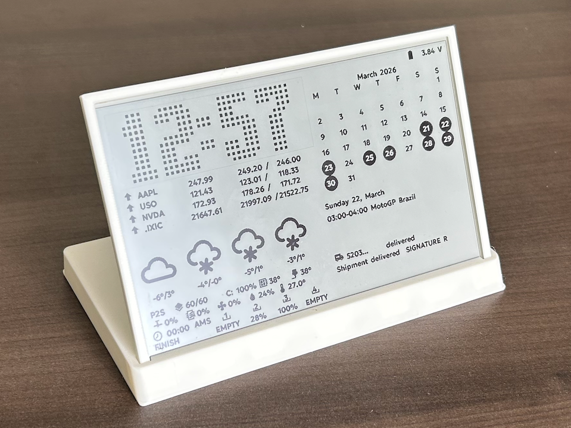
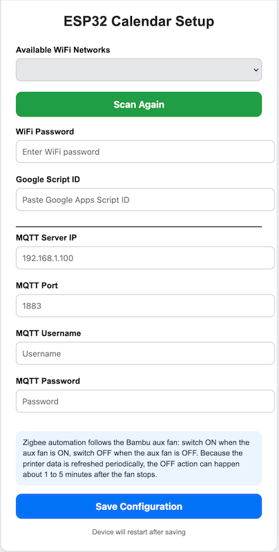

# ESP32 ePaper Desk Dashboard



A customizable desk dashboard for ESP32 boards and 7.5" ePaper displays. It combines local status widgets, cloud-fetched data, and optional Zigbee automation in a single low-power display.

## Overview

This project is designed for a desk or workshop display that can show:

- time and date
- Google Calendar events
- weather forecast
- stock prices
- parcel tracking
- Proxmox server status
- Bambu Lab printer status
- MakerWorld statistics
- optional Zigbee automation

It supports configurable widget layout, cached data for offline rendering, and partial refresh on supported black-and-white ePaper panels.

## Highlights

- Multi-widget ePaper dashboard
- Remote configuration page on first boot
- Cached layout and widget data in Preferences
- Configurable widget refresh intervals
- Optional ESP32-C6 Zigbee support
- Support for prebuilt firmware and local compilation

## Hardware

Minimum setup:

- ESP32 board
- 7.5" GxEPD2-compatible ePaper display
- Wi-Fi network

Optional:

- battery-powered setup
- Bambu Lab printer via MQTT
- Zigbee switch for automation

Boards used during development:

- ESP32: Lolin D32
- ESP32-C6: DFRobot FireBeetle 2 ESP32-C6
- ESP32-C6 SuperMini: MakerGO-style ESP32-C6 SuperMini clone

Hardware sourcing note:

- the ESP32 boards and accessories used during testing came from common AliExpress-style marketplace listings
- the e-paper display used during testing was purchased from Amazon
- clone boards and hats can vary slightly, so verify the pinout if your hardware differs

Important notes:

- most color ePaper displays do not support partial refresh
- some large panels can take 20+ seconds for a full refresh

## Pin Reference

| ESP Model | CS | DC | RST | BUSY | SCK | MOSI | Display Power | Battery | Demo Button |
| --- | ---: | ---: | ---: | ---: | ---: | ---: | ---: | ---: | --- |
| ESP32-C6 SuperMini | `4` | `20` | `21` | `22` | `7` | `5` | `1` | not used | `GPIO_NUM_2` |
| ESP32-C6 | `1` | `8` | `14` | `7` | `23` | `22` | `4` | `0` | `GPIO_NUM_2` |
| ESP32 | `15` | `27` | `26` | `25` | `13` | `14` | `4` | `35` | `GPIO_NUM_33` |

The board wiring now uses a preset-backed pin map in [configure.h](configure.h). The firmware auto-selects the matching default preset for `ESP32` or `ESP32-C6`, and you can switch presets with `applyPinPreset(...)` or provide a fully custom mapping with `setCustomPinConfig(...)` before the display is initialized.

For ESP32-C6 SuperMini boards, the validated preset avoids the onboard RGB LED pin on `GPIO8` and turns the onboard LEDs off in firmware when that preset is selected.

## Wake Button

The wake/demo input is optional. If you do not connect a button or touch-output board, the device will still work normally and will wake on timer only.

Demo mode and forced configuration mode require an external trigger on the configured wake/demo pin, such as:

- a physical push button
- a `TTP223` capacitive touch switch module used as a simple digital output

When a wake/demo button is configured, the firmware checks it at boot and on deep-sleep wake.

- short tap: normal boot, no special action
- hold about 2 seconds: enter demo mode
- hold about 6 seconds: force configuration mode / AP setup

Preset defaults:

- `ESP32-C6 SuperMini`: wake/demo pin `GPIO_NUM_2`, suitable for a `TTP223` output used as a simple digital wake signal
- `ESP32`: wake/demo pin `GPIO_NUM_33`

## Build Options

### Arduino IDE

Open [firmware.ino](firmware.ino), select the correct ESP32 board, then compile and upload as usual.

For Zigbee on ESP32-C6:

- set `USE_ZIGBEE` to `1` in [configure.h](configure.h)
- use an ESP32-C6 board
- select a Zigbee-capable partition scheme and Zigbee mode in the board menu

### arduino-cli

The repo includes [sketch.yaml](sketch.yaml) profiles.

Standard ESP32 build:

```bash
arduino-cli compile --profile esp32 .
```

ESP32 Waveshare build:

```bash
arduino-cli compile --profile esp32_waveshare .
```

ESP32-C6 FireBeetle build:

```bash
arduino-cli compile --profile esp32c6_firebeetle .
```

ESP32-C6 FireBeetle Zigbee build:

```bash
arduino-cli compile --profile esp32c6_firebeetle_zigbee .
```

ESP32-C6 SuperMini build:

```bash
arduino-cli compile --profile esp32c6_supermini .
```

ESP32-C6 SuperMini Zigbee build:

```bash
arduino-cli compile --profile esp32c6_supermini_zigbee .
```

Only the ESP32-C6 builds have Zigbee variants.

If you prefer a direct command, this Zigbee build works:

```bash
arduino-cli compile \
  --fqbn esp32:esp32:esp32c6:PartitionScheme=custom,ZigbeeMode=zczr \
  . \
  -e
```

Why Arduino IDE and `arduino-cli` can behave differently:

- Arduino IDE remembers board-menu selections in the GUI
- `arduino-cli` needs those board options passed explicitly
- Zigbee on ESP32-C6 requires both the correct partition scheme and Zigbee mode

## Prebuilt Firmware

Prebuilt merged binaries are available in the project releases:

- [ESP32-eInk-Dashboard releases](https://github.com/VoIPshare/ESP32-eInk-Dashboard/releases)

To flash them from a browser, you can use:

- [espboards.dev firmware programmer](https://www.espboards.dev/tools/program/)

Use address `0x0000` when flashing the merged image.

## First Boot and Device Setup

After flashing:

1. power on the device
2. connect to the setup Wi-Fi network: `Dashbboard-Setup`
3. open `http://192.168.4.1`
4. fill in the configuration page




The setup page can store:

- Wi-Fi SSID and password
- device timezone
- Raspberry Pi address (IP[:port], `/dashboard` is assumed when no path is given)
- MQTT IP, port, username, and password
- pin preset selection
- custom pin mapping when `Custom` is selected
- optional Zigbee-related settings when Zigbee firmware is enabled

These settings are stored on the device. Depending on upload and erase settings, they may be reset after flashing new firmware.

The AP web configuration page is also where you can:

- choose a predefined board wiring preset
- expand the `Custom` preset to enter your own pin mapping
- set the fallback timezone used by the clock when the layout does not define one
- configure wake/demo behavior through the selected wake/demo input pin

## Zigbee Notes

Zigbee support is intended for ESP32-C6 builds.

Current behavior:

- Zigbee control follows the Bambu aux fan state
- when the aux fan turns on, the Zigbee switch is turned on
- when the aux fan turns off, the Zigbee switch is turned off

Because printer status is refreshed periodically, the Zigbee off action can happen about 1 to 5 minutes after the fan stops.

## Data source (Raspberry Pi aggregator)

This personal fork drops the Google Apps Script dependency. The firmware now
expects a **local Raspberry Pi** to act as the central data source, exposing a
single consolidated JSON endpoint over plain HTTP on the LAN. See
[`pi-aggregator/`](../pi-aggregator/) for the Python service.

Supported data:

- parcel tracking
- calendar events
- layout configuration
- weather
- Claude usage

### Configuration

Enter the Pi address on the device setup page (not in the source code):

```text
192.168.1.50:8080
```

Without an explicit path, the firmware appends `/dashboard`. A bare `http://`
prefix is accepted and stripped; HTTPS is intentionally not used between the
ESP32 and the Pi (local network, lower awake time and RAM use).

The firmware makes a single HTTP GET per wake-up and parses the JSON returned by
the aggregator. The expected schema (the "JSON contract") is documented in
[pi-aggregator/golden/README.md](../pi-aggregator/golden/README.md).

### Layout Tips

Clock widget:

- put the timezone string in the `Extra1` field of the clock row
- example:

```text
EST5EDT,M3.2.0/2:00:00,M11.1.0/2:00:00
```

Weather widget:

- `Extra1`: latitude
- `Extra2`: longitude

Example:

- `Extra1 = 40.712`
- `Extra2 = -74.006`

## Fonts

Font tooling and conversion notes are documented in [fonts/README.md](fonts/README.md).

That folder includes:

- conversion scripts
- glyph lists
- Material Design icon setup
- ePaper font optimization notes

Important:

- glyph order must remain consistent

## 3D-Printed Case

The case model is available here:

- [MakerWorld enclosure model](https://makerworld.com/en/models/2443888-epaper-dashboard-7-5-with-esp32-desktop-version)

## CI Builds

GitHub Actions can build firmware for:

- ESP32
- ESP32-C6 (FireBeetle, SuperMini, XIAO)
- ESP32-C6 with Zigbee

The workflow uses the repo [partitions.csv](partitions.csv) and can inject a firmware version string that is shown on the device near the battery indicator.

## Project Structure

Key files:

- [firmware.ino](firmware.ino): main sketch, display update flow, setup portal
- [configure.h](configure.h): board options, feature flags, icon constants
- [fetchAllInfo.cpp](fetchAllInfo.cpp): JSON parsing and widget rendering
- [bambulab.cpp](bambulab.cpp): printer status and MQTT fetch
- [dash_zigbee.cpp](dash_zigbee.cpp): Zigbee integration
- [pi-aggregator](../pi-aggregator): Raspberry Pi data source (current)
- [googleScripts](../googleScripts): legacy Apps Script samples (reference only, no longer used)

## Licenses and Attribution

Material Design Icons:

- source: [materialdesignicons.com](https://materialdesignicons.com/)
- license: Apache 2.0

Montserrat:

- source: [Google Fonts](https://fonts.google.com/specimen/Montserrat)
- license: SIL Open Font License 1.1

HighSpeed:

- source: [dafont.com/high-speed.font](https://www.dafont.com/high-speed.font)
- license: free for personal use, commercial use requires permission

## Contributing

Contributions are welcome. Good areas for improvement include:

- new widgets
- layout and UI polish
- performance tuning
- network and parsing robustness
- documentation

Open an issue or submit a pull request if you want to contribute.
